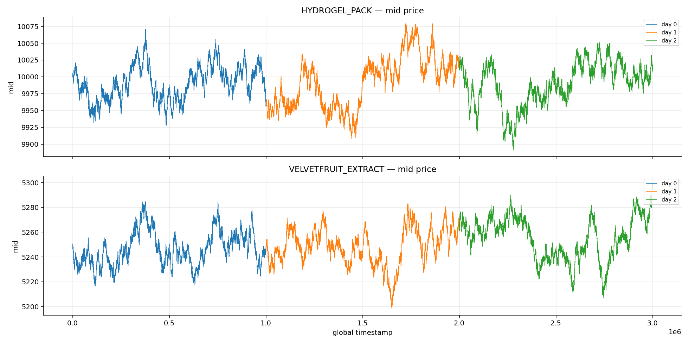
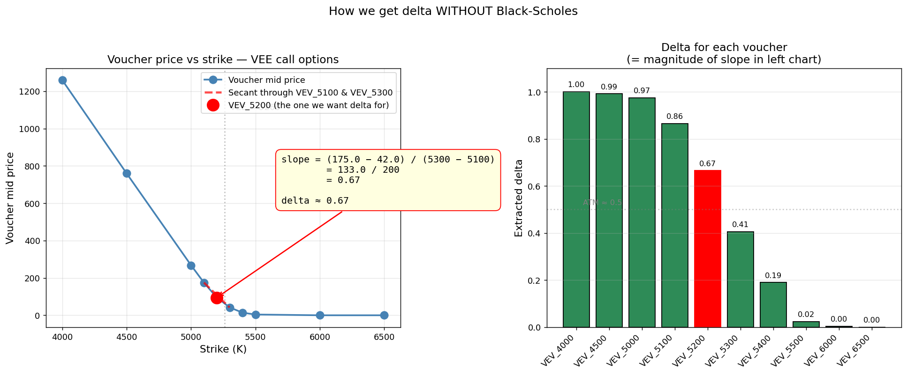
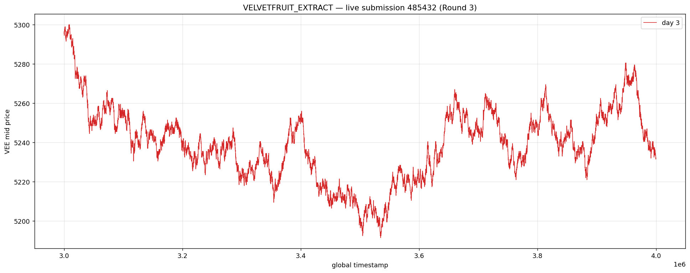
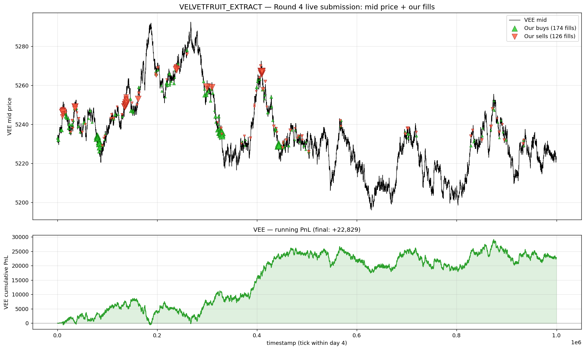
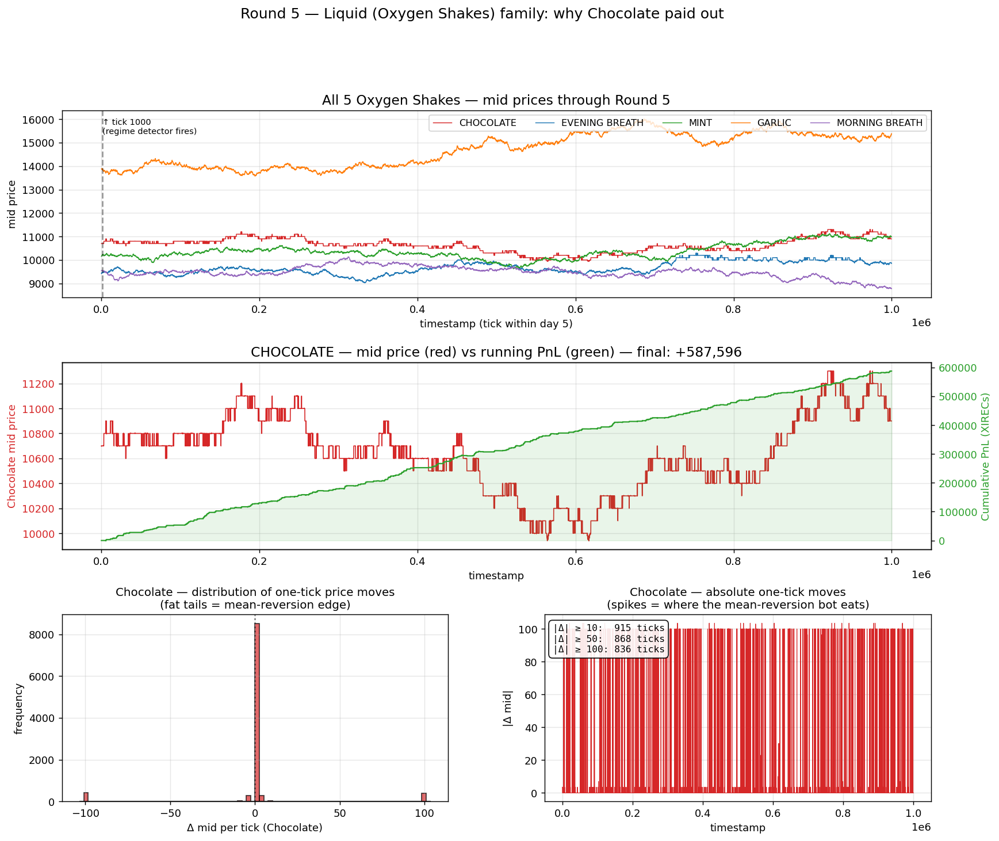
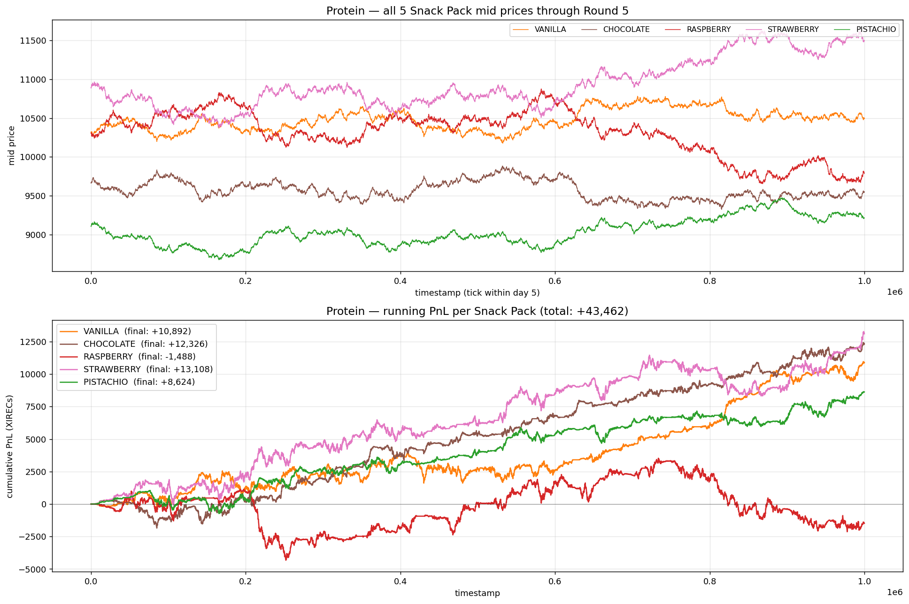

# IMC Prosperity 4

Our team, `Pink Fluffy Dumplings` finished **#13** globally in IMC Prosperity 4 with a cumulative Phase-2 PnL of 1,096,164 XIRECs (Algo 1,062,502 + Manual 33,662). On the algorithmic challenge alone, we finished **#9 globally**. This placed us **#4 in Australia** overall, and **#2** in the algorithmic component.

This writeup includes the strategies and ideas we implemented, and takeaways from Prosperity - our first algorithmic trading competition :) 

> *Note: Our final round submission was unfortunately copied by another team, so although we were still scored, our final rank wasn't initially published onto the public leaderboard. We emailed the Prosperity team and they kindly confirmed we *"still appeared as 13th globally"* on their final recruiter leaderboard.*

## Round 3 — Mean Reversion & Inverse Momentum

**Algo PnL: +103,038** • **Algo rank: #262** • **Manual PnL: +71,118** • **Manual rank: #420** • **Round 3 total: +174,156**

Round 3 gave us two underlying products — `HYDROGEL_PACK` and `VELVETFRUIT_EXTRACT` (VEE) — plus a full chain of vouchers (european options) on VEE across strikes from 4000 to 6500. Plotting the mid prices for both stocks immediately suggested mean reversion: noisy, range-bound walks with no persistent drift.

  

Our first attempt on the options was IV scalping, an idea borrowed from previous years' writeups. However, we eventually realised that the volatility smile wasn't stable enough — the IV wobble wasn't profitable enough to scalp relative to the noise in the parabola fit. We later realised it was more profitable to trade the vouchers directionally as part of mean reversion.

For `HYDROGEL_PACK` we also did mean reversion. We calculated the mean/fair value at **9990**, and ran a sweep of backtests to find entry levels: buy down to max long when the mid fell ~45 below fair (around **9945**), neutralise back to flat at fair (**9990**), and sell to max short when the mid rose ~30 above fair (around **10020**). We implemented this using three resting limit orders sized to fill when something crossed each level.

We also tried to build a regime logic off the opening prints. If VEE opened high we'd lean harder long on `HYDROGEL_PACK` with a lower buy grid and treat the vouchers differently; if `HYDROGEL_PACK` itself opened cheap, a separate set of voucher logic kicked in. We later realised this part was overfit.

We also noticed VEE tended to overshoot the mean and then bounce on each move, so instead of the standard "buy low, sell high, flatten in the middle" band, we tried a more aggressive version: whenever VEE retraced 35 points from a local extreme, we would take our max position in the direction of the eventual reversion. Based on previous data, we predicted that VEE and the vouchers would bounce at the extremes more reliably than they would drift through the mean.

For the vouchers, we implemented a more involved idea for this round. We computed the rough deltas of each voucher to estimate where they should be priced, then bought or sold them relative to the VEE signal. Rather than fitting Black-Scholes, we extracted each voucher's delta directly from the chain by taking the slope of voucher mid price against strike — a model-free shortcut that sidesteps having to know TTE or volatility.

  

***Strategy:*** `HYDROGEL_PACK` — symmetric mean-reversion band (buy ≈ 9945, neutral 9990, sell ≈ 10020) via three resting orders, with opening-regime adjustments. VEE — inverse-momentum reversal trading: track the running anchor, and on a reversal of ≥35 from the extreme, take max long/short into the next bounce. Vouchers — directional long/short tied to the VEE signal, with empirical deltas pulled from the chain slope used to translate VEE-side triggers into voucher-side entry/exit prices.

**What went wrong:** Unfortunately, we got quite unlucky. VEE opened high and fell *straight to the bottom* during the first half of the day without bouncing in the way we predicted, so we were positioned for a reversal that never came and made far less than a plain mean-reversion approach would have. We had spotted the right structure but traded it the wrong way. The simpler, more robust version of a signal usually generalises better than the clever one that maxes out the backtest.

  

## Round 4 — Generalised Mean Reversion

**Algo PnL: +216,678** • **Algo rank: #30** • **Manual PnL: −58,240** • **Manual rank: #1200** • **Round 4 total: +158,438**

Following Round 3, we realised we overfit quite a bit, and since we were scared of overfitting, tried to make a more robust/generalised algorithm. We initially tried to market make all products while computing a set of rolling stats (mean and std) for all products, and once they were computed, start mean reverting based on that. This made money in the backtest but performed poorly on the website as it took time to warm up.

We tracked a running mean of VEE, with two bands around it: a **slow band** (built from the std of mid prices — only fires on big drifts, high conviction) and a **fast band** (built from the std of tick-to-tick returns — fires on sudden spikes, but only if a consistent direction had been firing repeatedly). As the running mean would have issues when the price starts high/low, we included hardcoded thresholds to double check, before betting on reversion in a certain direction.

For vouchers, we extracted deltas from the vouchers in the same manner as Round 3. When VEE was signalling a direction, we took a max position into the high-delta vouchers (most VEE-correlated). When no signal was firing, we just market-made the single highest-delta voucher to collect spread on the most stock-like option in the chain.

Since we got punished a lot for overfitting, we didn't use a fixed banded mean reversion strategy which would've made more money on both round 3 and 4 — we could've started tracking the rolling stats with some information from previous rounds weighted in too but didn't want to risk overfitting. We placed #30 in algo this round, and our cumulative algo rank climbed from #262 to roughly #100 overall by the end of Round 4.

**Other notes:**
- We spent considerable time tracking bot behaviours for insider trading and flow patterns once trader names were revealed, but couldn't find any signals — we don't believe there were any major ones to find.

  

Looking at the graph, if we'd implemented fixed target bands like other teams who performed much better this round, we could've made a lot more money — but our model was still quite robust and would've generalised well across many different movement patterns.

## Round 5 — 50 Tradeable Products :D

**Algo PnL: +742,786** • **Algo rank: #5** • **Manual PnL: +20,784** • **Round 5 total: +763,571**

### Liquid — Oxygen Shakes (+668,271)

**What we found.** Several products showed weird ±100-tick jumps that snapped back, so we found a fair value with mean-reversion dampening to be particularly profitable across the family.

**What we built.** We market-made on all 5 products, computing a fair value on every tick. Each tick we'd see how much fair had moved since the previous tick, and adjusted our fair value by a fraction of this move. With a shifted fair, we'd dime one side and let the other side retreat below the best bid/ask — biasing fills toward the mean-reverting direction. If the move was so violent that the market mispriced relative to our adjusted fair (an ask sitting below fair − edge), we'd cross the spread and lift it directly.

After backtesting, Chocolate got the most aggressive setup:
- **0.115 mean-reversion factor** (dampens each tick's fair move by 11.5%)
- **0.2 inventory skew** (twice the default — unloads inventory hard once it builds up)
- **`take_edge = 1 tick`** — pickier about which offers to take, only lifting asks more than 1 tick below fair

Evening Breath used the default 0.12 factor — same idea, slightly weaker.
Mint / Garlic / Morning Breath had a one-shot regime detector at tick 1000: snapshot the open price, check the current price, and turn mean reversion on or off based on whether the day opened in the predicted direction.

  

**How it turned out.** Chocolate alone made +587,596 — 84% of the entire round PnL. Our algo profited off of ~2000 round-trips of mean reversion across the session. Evening Breath added +68,734 with the same mechanic at smaller amplitude. Mint and Garlic's regime detector fired correctly and added small wins. Morning Breath opened the "wrong" way, so its regime stayed off and it did nothing.

### Protein — Snack Packs (+43,462)

**What we found.** Vanilla ↔ Chocolate were perfect negatives. Raspberry ↔ Strawberry too. Pistachio didn't do much. No lead-lag — they all moved together at the same instant.

**What we built.** Wall-mid MM with two layered mean-reversion adjustments stacked on top of the fair value:

- **Per-product residual** — every snackpack tracks its own slow EMA. If the price drifts away from the EMA, fair gets pulled back toward it, which causes our quote to lean towards just the mean-reverting side (same mechanism as Liquid).
- **Basket residual** — since the products were negatives of each other, the family mean should be roughly constant. We averaged all 5 mids together as a "basket" and tracked that with its own EMA. If the basket was drifting one way (meaning all products moving in one direction), we'd increase the signal to mean-revert those products — but only those whose own residual agreed with the basket's residual.

Interestingly, we didn't explicitly pairs trade between Vanilla / Chocolate or Raspberry / Strawberry like other teams. The basket framework includes the pair idea automatically: when Vanilla and Chocolate move opposite each other, their moves cancel in the basket average, so the basket layer stays quiet and each product gets only its own per-product fade — which naturally trades the pair without us having to construct one explicitly. Whereas if they both move in the same direction, they receive some additional mean-reversion bias.

  

**How it turned out.** All five products positive except Raspberry. Four winners between +8k and +13k for a combined family PnL of **+43,462**. The basket-alignment filter did its job — prevented us from over-betting against single-product moves.

### Purification — Pebbles (+32,746)

**What we found.** The 5 sizes summed to ~50,000 every tick. Sometimes the sum deviated by ±15 but snapped back next step — but this wasn't profitable to trade directly. Individual sizes had directional drifts — XS and S trended down, XL trended up, L mean-reverted — but these were mostly noise.

**What we built.** Since prices were overall constant, we just market-made all 5 sizes. We added a basket-momentum gate as a safety filter: sum the 5 mids, look back 20 ticks. If the basket was trending up, zero out the buy quote that tick (don't lean into the rally). If trending down, zero out the sell quote. Per-product hard loss limit of −100 → permanently disable that size for the rest of the day.

**How it turned out.** Half the sizes won big (S +25k, XL +17k), half lost (L −9k, M −6k). Net +33k. The basket-sum-to-50k invariant did most of the work — when one pebble drifts the others have to compensate, so passive MM picks up spread on the compensating moves. We could have shipped a directional bet too (short XS+S, long the rest, per our notes) but didn't want to commit without more validation.

### Other families — what we tried, what worked, what didn't

We tried market making, with biases towards certain product directions whenever we saw a signal, but we performed quite poorly on the 7 families, with a combined ~−1.7k net, with mild winners (Galaxy +16k, UV +13k, Organic +0.2k, Domestic +0.1k) offset by mild losers (Construction −5.7k, Vertical −6k, Instant −19.8k).

**Lead-lag (Organic Microchips).** We noticed Circle leading the other four chips, with weak single-lag correlation (~0.05) that grew to ~0.15 when aggregated over wider windows. We implemented a Circle → Oval Z-score overlay that biased Oval's quotes toward Circle's recent move. But the lag wasn't at fixed ticks — the signal lived in inconsistent, drifting windows — and by the time the signal was visible the spread had already eaten most of the edge. We came out roughly neutral (+234 across all 5 chips), and if we had more time would've liked to find out if this signal could be profitable.

Most of these families we found to be mainly noise, and it would've been difficult to trade them aggressively outside of pure market making.

Algorithmic ranking was #5 for this round. With so much alpha in the reversion of the ±100 moves on Chocolate, we climbed from top-100 algo to **#9** globally by the end of the competition.

## Manual

### Round 1 — [X]
[What you did.]

### Round 2 — [X]
[What you did.]

### Round 3 — [X]
[What you did.]

### Round 4 — [X]
[What you did.]

### Round 5 — [X]
[What you did.]
